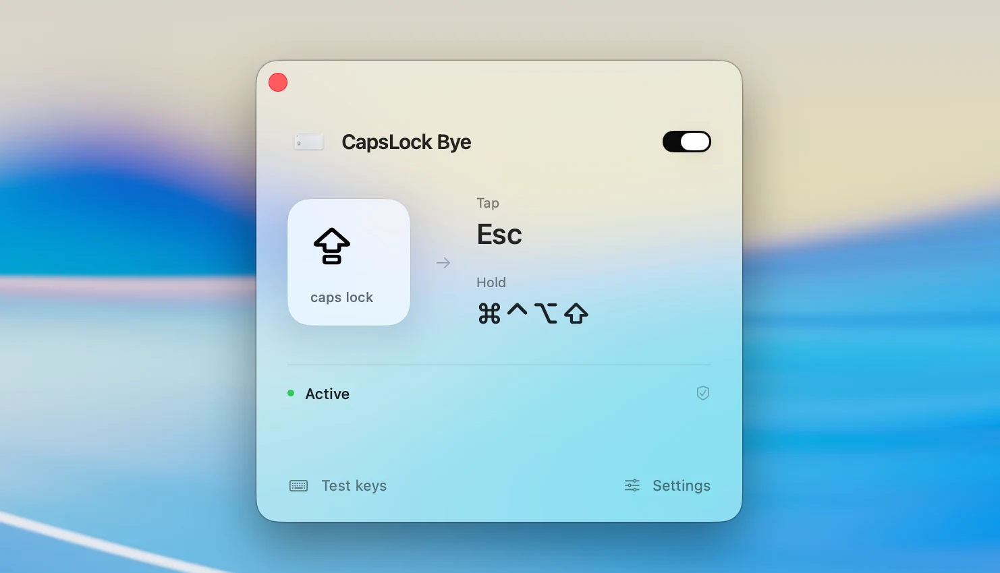

# CapsLock Bye 👋

**Tap Caps Lock for Escape. Hold it for Hyper (⌘ ⌃ ⌥ ⇧).**

[简体中文](docs/README.zh-CN.md) · [Download](https://github.com/nixihz/capslock-bye/releases/latest) · [Issues](https://github.com/nixihz/capslock-bye/issues)

[](https://github.com/nixihz/capslock-bye/actions/workflows/ci.yml)

A small, native macOS menu bar app. It processes keys locally without recording or uploading what you type. No account or driver required.



## Features

- Choose a key or record a shortcut for a tap; customize the modifiers used for a hold.
- Adjust the hold threshold (180 ms by default). Press another key or click the mouse to activate a chord immediately.
- Built-in key tester, permission setup, and optional launch at login.
- English and Simplified Chinese. Liquid Glass on macOS 26, native system materials on macOS 14–15.

## Install

Requires **macOS 14 or later**, on Apple Silicon or Intel.

1. Open the [latest release](https://github.com/nixihz/capslock-bye/releases/latest) and download the versioned `.dmg` asset.
2. Open it, drag **CapsLock Bye.app** to **Applications**, then eject the disk image.
3. Launch the app and follow its guide to enable **Accessibility** and **Input Monitoring** in **System Settings → Privacy & Security**.
4. Reopen the app if macOS asks, enable mapping, and try the key tester.

Release DMGs are signed and Apple notarized. Each release includes a matching `.dmg.sha256` checksum file alongside the versioned installer.

## Use

Close the window to keep the app in the menu bar. Left-click its icon to reopen it; right-click to pause or quit. Customize tap shortcuts, hold modifiers, timing, and language in Settings.

Disable other tools' Caps Lock mappings and keep Caps Lock at its default in keyboard firmware and system settings. Mapping pauses while macOS Secure Input is active, such as in some password fields, and resumes afterward.

## Build from source

Requires **Xcode 26 or later**, including the macOS 26 SDK and Swift 6.

```sh
git clone https://github.com/nixihz/capslock-bye.git
cd capslock-bye
./script/build_and_run.sh
```

The app is built at `dist/CapsLock Bye.app`. A developer certificate is optional; without one, the script uses ad-hoc signing. macOS may ask you to grant permissions again after rebuilding.

## Contributing

Issues and pull requests are welcome in English or Chinese. See [CONTRIBUTING.md](CONTRIBUTING.md) for development commands and checks.

GitHub Actions tests and builds a universal app on pushes and pull requests. Use **Actions → CI → Run workflow** for a manual development build, or **Actions → Release → Run workflow** to publish a signed, notarized DMG. Maintainers can follow the [release guide](docs/releasing.md) for signing secrets and version requirements.

## License

[MIT](LICENSE) © 2026 nixihz.
